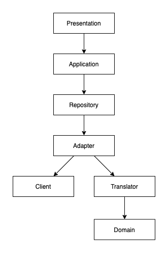

# anti-corruption-layer-demo

腐敗防止層の実装サンプル

## how to setup

```sh
pipenv install
pipenv run src/main.py
```

## sample request and response

### request

```sh
curl http://127.0.0.1:5042/forecast/340010
```

### response

```json
{
  "today": {
    "max_temperature": "16",
    "min_temperature": "7",
    "telop": "晴時々曇"
  },
  "tomorrow": null,
  "prefecture": "広島県",
  "city": "広島"
}
```

## 解説

DDD の腐敗防止層の実装イメージがわかなかったので、Pythonで実装してみた。

外部APIとして [お天気Webサービス仕様 - Weather Hacks - livedoor 天気情報](http://weather.livedoor.com/weather_hacks/webservice) を使用した。

`city_id` は [全国の地点定義表](http://weather.livedoor.com/forecast/rss/primary_area.xml) を参照。

## architecture


